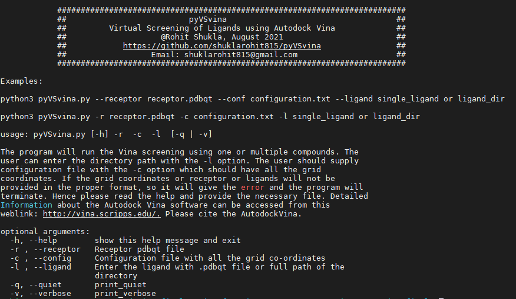
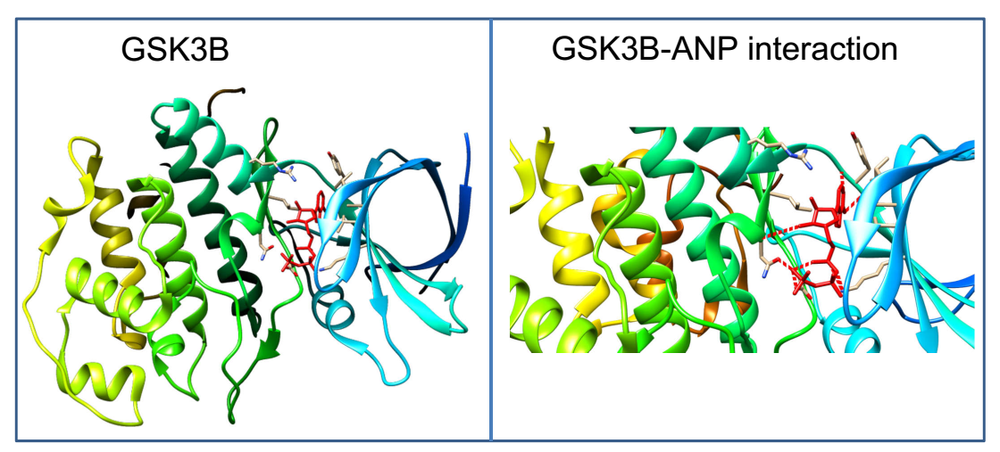
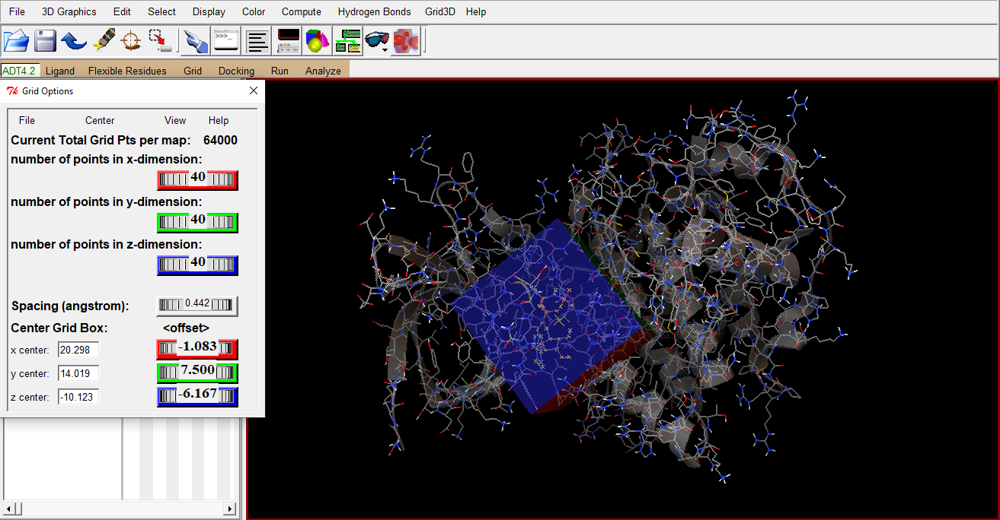

# pyVSvina
 pyVSvina is a python based tool for Virtual Screening of a library of ligands against a protein receptor using Autodock Vina.
 # Installation
 Download the contents of repository and add it to your $PATH variable or simply use the pyVSvina script with the python3.

    $ export PATH=":$PATH"

You can add above line to your .bashrc file.

# Usage:

<h3> if path is added in the system so please run this command: </h3>

    $ pyVSvina.py --help

<h3> else run this command: </h3>

    $ python3 pyVSvina.py --help

# What you need
1. [pyVSvina](https://github.com/shuklarohit815/pyVSvina) for virtual screening.
2. [pySDF2PDBQT](https://github.com/shuklarohit815/pySDF2PDBQT) for ligand conversion.
3. [Autodock Vina](http://vina.scripps.edu/) for docking.
4. [Autodock Tools](https://autodock.scripps.edu/) for receptor preparation.
5. [Chimera](https://www.cgl.ucsf.edu/chimera/) for visualising docked ligand complexes.

# Ligand preparation
Please use the [pySDF2PDBQT](https://github.com/shuklarohit815/pySDF2PDBQT) tool for ligand preparation. The tool will convert the sdf files in to the pdbqt files with the help of open babel. We will use these pdbqt format ligands for virtual screening.

# Preparing receptor for docking
For docking the ligands to receptor, receptor pdb file must be converted to pdbqt file. Our receptor is glycogen synthase kinase 3 beta [PDBID : 1J1B](https://www.rcsb.org/structure/1J1B) from which the ligand AMPPNP has been removed. We want to dock ligands from our library in the same place where AMPPNP was originally bound. The AMPPNP is the analog of ATP.

Copy the GSK3B pdb file (1J1B.pdb) to the current working directory.

Open GSK3B (PDBID: 1J1B) with autodock tools using command line.

    $ adt 1J1B.pdb

You can also open the 1J1B.pdb using the Autodock GUI import wizard.

File -> Read molecule -> select 1J1B.pdbqt

Then do the following steps:

Add polar hydrogen: Edit -> Hydrogen -> Add -> Polar only

Add charges: Edit -> Charges -> Add Kollman Charges

Add non-polar hydrogens: Edit -> Hydrogen -> Add -> Merge Non-Polar

Select area for docking: Grid -> Grid Box

Set spacing according to your need

Choose x center, y center and z center value

Choose number of points in x,y and z direction ( by rotating dials )

Choose offset ( by rotating dials)

The chosen values define an area where ligands would be docked. The area outside the box will not be explored.

<h3> Save the chosen values in conf.txt file </h3>

#
center_x = 40.00

center_y = 40.00

center_z = 40.00

size_x = 20.298

size_y = 14.019

size_z = -10.123

energy_range = 4

exhaustiveness = 8
#

Delete the ANP molecule before saving the 1J1B.pdbqt

Select the ANP from the right side panel in the Autodock Tools.

Edit -> Delete -> Delete selected molecules.

Save the molecule in a pdbqt file: Grid -> Macromolecules -> Choose -> 1J1B -> save 1J1B.pdbqt

<h3> Please refer this Youtube video tutorial to learn more about Autodock Tools </h3>.
[Molecular docking using Autodock with Result analysis](https://www.youtube.com/watch?v=6IEaRqRGrss&t=4476s)

# Virtual Screening with pyVSvina

pyVSvina will use Autodock Vina to dock one ligand at a time from the ligand library to chosen area in GSK3B.

Run the following command:

$ python3 pyVSvina.py -r 1J1B.pdbqt -c conf.txt -l DRUGBANK_pdbqt_ligands/

After successful completion of pyVSvina tool you will get follwing files and folders.

1. Results : This folder will have the docking conformation pdbqt files and log files of all the ligands.
2. Top_10_Compounds_pdbqt_file : This folder will have top 10 compounds docking conformation pdbqt files and their binding affinity in decending order.
3. Summary_file : It is a CSV file have binding affinity for all the ligands.
4. Summary_sorted : It is a CSV file have sorted binding affinity in decending order for all the ligands.

You can use the docking conformation pdbqt file to make the 1J1B-ligand complex using any software such as Autodock Tools, Chimera and PyMol etc.

                              If you are facing any error. Please feel free to write at shuklarohit815@gmail.com

<h4> Happy screening 😊 </h4>

I want to thanks Dr. [Tiratha Raj Singh](http://www.bioinfoindia.org/raj/) and Dr. [Narendra Kumar](https://narekum.github.io/) for the suggetions and encouragement in making of this tool.

If you want to use perl based virtual screening tool so please refer [VSvina](https://github.com/narekum/VSvina) developed by Dr. [Narendra Kumar](https://narekum.github.io/).

